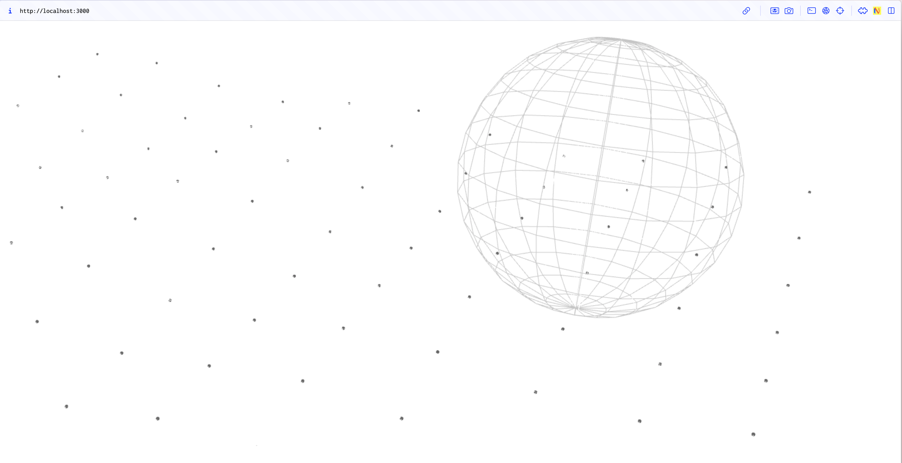

### Next.js + Vanta.js

This is a simple project to demonstrate how to use Vanta.js with Next.js.

### Links

- Globe background from [Vanta.js](https://www.vantajs.com/?effect=globe)
- Related code on [GitHub](https://github.com/tengbao/vanta/blob/master/src/vanta.globe.js)
- [THREE.js documentation](https://threejs.org/docs/)
- [Three npm package](https://www.npmjs.com/package/three)
